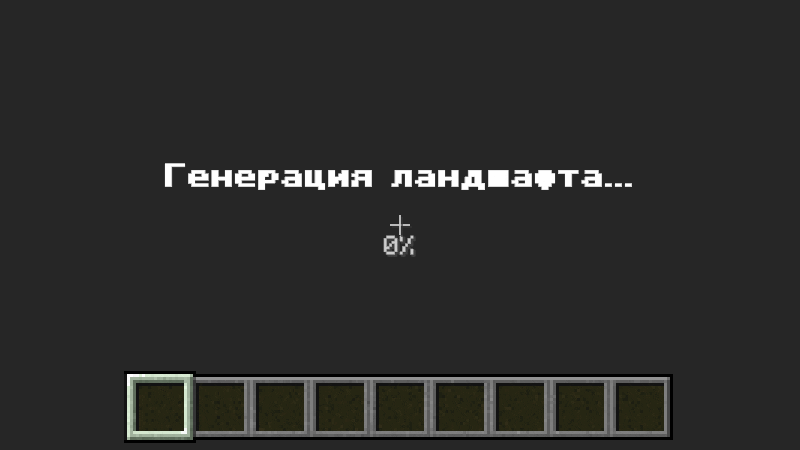

# 🧱 Unicraft — Voxel Engine in Unity

[](https://unity.com/)
[](https://docs.microsoft.com/en-us/dotnet/csharp/)
[](LICENSE)
[]()

> A high-performance, modular voxel sandbox engine developed from scratch in Unity (C#). Focuses on procedural 3D mesh generation, runtime chunk modification, and decoupled gameplay architectures.

---



---

## 💡 Engineering Highlights

Building a voxel engine in Unity requires bypassing standard GameObject-per-block workflows in favor of low-level graphics and memory management:

- **Custom Procedural Mesh Builder:** Generates dynamic 3D meshes at runtime by calculating vertex arrays, triangle indices, and normal vectors programmatically.
- **Hidden Face Culling Optimization:** Algorithms check adjacent voxel states across 6 cardinal directions (+X, -X, +Y, -Y, +Z, -Z), omitting internal, non-visible faces. Reduces chunk polycount and vertex overhead by up to **75–80%**.
- **Texture Atlas & Dynamic UV Mapping:** Entire block palette rendered via a single material and texture atlas. UV coordinates are dynamically calculated per-face based on block metadata, keeping Draw Calls minimal (1 Draw Call per Chunk).
- **Runtime World Modification:** Raycast-driven voxel manipulation. Editing a block triggers localized sub-mesh rebuilds without stalling the main render thread.
- **Decoupled Architecture:** Event-driven inventory, ScriptableObject-driven block/item databases, and stateless utility classes for voxel math.

---

## 🕹️ Core Features Implemented

### 🌍 Voxel World & Chunk Pipeline
- **Chunk Spatial Partitioning:** World divided into uniform chunks (e.g., 16 × 16 × 16 / 16 × 256 × 16 data blocks).
- **3D Array Voxel Storage:** Lightweight byte-based representation for block types to optimize memory footprint.
- **Procedural Surface Generation:** Initial heightmap and terrain distribution using multi-layered coherent noise algorithms.
- **Dynamic Block Editing:** Instant block destruction and placement with immediate collision mesh (`MeshCollider`) updates.

### 🏃 Gameplay & Character Controller
- Physics-based First-Person Controller (walking, jumping, gravity, head-bobbing).
- Custom collision resolution and raycasting tailored for discrete cubic grids.
- Target block wireframe outline / highlight indicator.

### 🎒 Inventory & Interaction System
- Grid-based inventory UI with item slot data containers.
- Hotbar system with active slot selection (1–9 keys & Mouse Scroll).
- ScriptableObject architecture for item data (textures, stack limits, block association).
- Resource harvesting mechanics with dynamic drops upon block breakdown.

---

## 🏗️ Technical Architecture

```
Assets/Scripts/
├── World/
│   ├── Chunk.cs              # Chunk data storage, local block lookup & state
│   ├── ChunkMeshBuilder.cs   # Procedural vertex/UV/triangle assembly & culling
│   ├── WorldGenerator.cs     # Noise algorithms, procedural generation pipeline
│   └── VoxelData.cs          # Static tables (voxel vertices, face checks, lookup vectors)
├── Player/
│   ├── PlayerController.cs   # Input handling, custom FPS movement & physics
│   └── BlockInteraction.cs   # Voxel raycasting, mining & placement triggers
├── Inventory/
│   ├── InventoryManager.cs   # Event-driven inventory data model
│   ├── InventorySlot.cs      # Slot state, item count, stacking logic
│   └── HotbarUI.cs           # Active item visualization & UI binding
└── ScriptableObjects/
    ├── BlockTypeData.cs      # Voxel metadata (UV offsets, hardness, transparency)
    └── ItemData.cs           # Base SO class for inventory items
```

---

## 🔬 How Mesh Generation Works (Under the Hood)

Instead of instantiating individual cube primitives:

1. The chunk iterates through its 3D block array `byte[x, y, z]`.
2. For each solid block, it inspects 6 neighbor coordinates.
3. If a neighbor is transparent or air, `ChunkMeshBuilder` appends 4 vertices and 6 triangle indices for that specific face.
4. UV coordinates are looked up in the `BlockTypeData` ScriptableObject and assigned to the UV buffer.
5. Buffers are committed to `Mesh.SetVertices()`, `Mesh.SetTriangles()`, `Mesh.SetUVs()`, followed by `RecalculateNormals()`.

```csharp
// Example: Direction-based neighbor check for Face Culling
public bool CheckVoxel(Vector3 pos) {
    int x = Mathf.FloorToInt(pos.x);
    int y = Mathf.FloorToInt(pos.y);
    int z = Mathf.FloorToInt(pos.z);

    if (IsOutOfBounds(x, y, z)) return false;
    return BlockDatabase.GetBlock(voxelArray[x, y, z]).isSolid;
}
```

---

## 🚀 Getting Started & Installation

### Requirements
- **Unity:** `6000.4 LTS` (or newer)
- **Render Pipeline:** Built-in / URP

### Setup
1. Clone the repository:
   ```bash
   git clone https://github.com/gsyncler/Unicraft.git
   ```
2. Open **Unity Hub** → Click **Add** → Select the cloned project folder.
3. Open project with Unity 2022.3+ and allow packages to restore.
4. Navigate to `Assets/Scenes/` and load the `Main` / `SampleScene`.
5. Press **Play** in the Unity Editor.

### Default Keybindings
| Input | Action |
|---|---|
| `W / A / S / D` | Movement |
| `Space` | Jump |
| `Mouse 0` (LMB) | Mine Block |
| `Mouse 1` (RMB) | Place Selected Block |
| `Mouse Wheel / 1–9` | Cycle Hotbar Slots |
| `E` | Toggle Inventory Interface |
| `Left Shift` | Sprint |

---

## 🗺️ Roadmap & Planned Optimizations

- [x] Procedural chunk mesh builder with directional face culling
- [x] Texture Atlas mapping system
- [x] Real-time block modification & physics updates
- [x] Basic inventory & hotbar UI
- [ ] **Multi-threading & Jobs/Burst:** Offload mesh generation calculations to Unity Job System
- [ ] **Greedy Meshing Algorithm:** Merge coplanar quad faces to drastically reduce polygon counts
- [ ] **Save / Load Serialization:** Compressed chunk data storage using Binary/JSON format
- [ ] **Infinite World Streaming:** Distance-based chunk loading/unloading thread loop
- [ ] **Day/Night Cycle & Biomes:** Perlin-based moisture/temperature maps

---

## 📚 What I Learned

- Chunk-based architecture and memory management in Unity
- Procedural generation with noise functions
- Mesh optimization techniques (face culling, mesh combining)
- ScriptableObject-driven data architecture
- Event-driven UI decoupling
- Performance profiling with Unity Profiler

---

## 👨‍💻 Author

**Daniil Kromlenko** — Unity & XR / C# Developer
- **GitHub:** [@gsyncler](https://github.com/gsyncler)
- **Telegram:** [@gscyler](https://t.me/gscyler)
- **Email:** shapeoflove.da@gmail.com

---

## ⚖️ Disclaimer & Intellectual Property

- **Source Code:** All original C# scripts, procedural generation logic, and architectural components are licensed under the [MIT License](LICENSE).
- **Game Assets:** Block textures and visual assets are sourced from [minecraft-assets](https://github.com/InventivetalentDev/minecraft-assets) and are the intellectual property of **Mojang Studios / Microsoft**.
- These assets are used strictly for **non-commercial, educational, and portfolio demonstration purposes** under fair use / fan-content principles. This project is not affiliated with, endorsed by, or associated with Mojang Studios or Microsoft.

---

## 📄 License

This project is licensed under the MIT License — see the [LICENSE](LICENSE) file for details.
