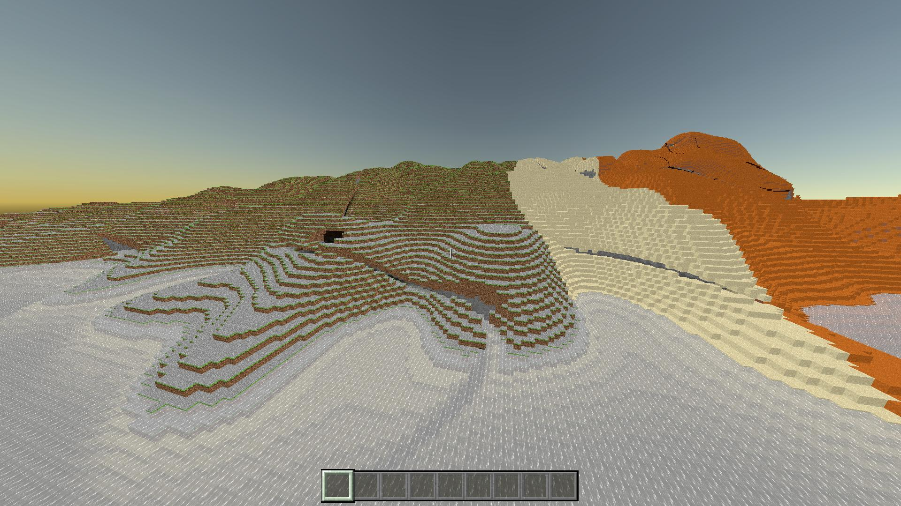
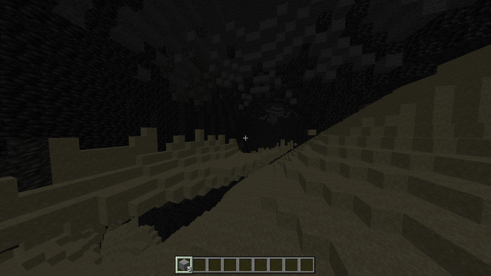
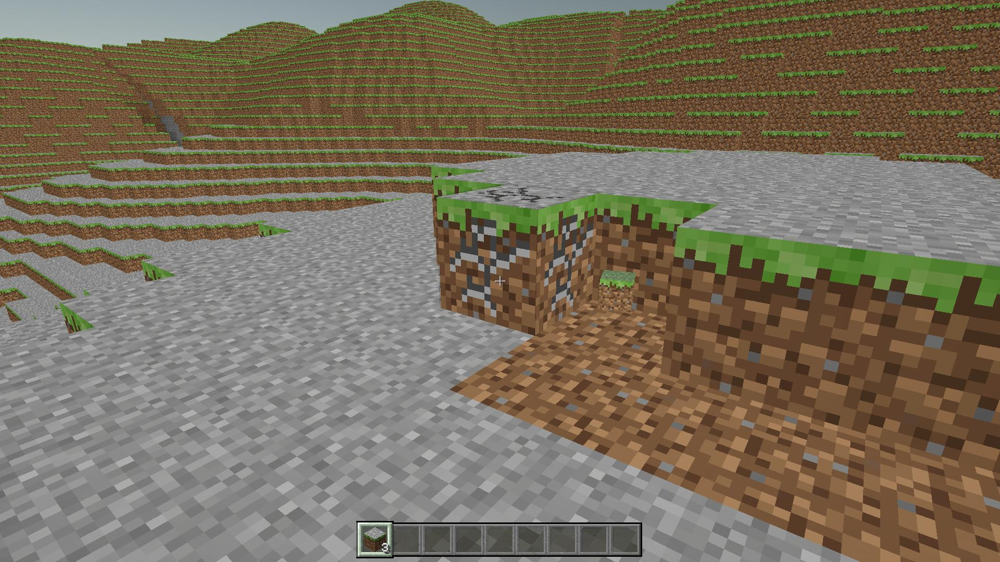

# 🧱 Unicraft — Voxel Engine in Unity

[](https://unity.com/)
[](https://docs.microsoft.com/en-us/dotnet/csharp/)
[](https://docs.unity3d.com/Packages/com.unity.render-pipelines.universal@17.0/manual/index.html)
[](LICENSE)
[]()

> A high-performance voxel sandbox engine built from scratch in Unity 6 (C#). Features Burst-compiled chunk generation, multi-noise terrain with caves, real-time sunlight propagation, and survival gameplay mechanics — targeting Minecraft 1.20 feature parity.

---


<!-- Replace with actual GIF: 20-30 sec of world gen + walking + mining + inventory -->

---

## 💡 Engineering Highlights

This is not a tutorial project. Every system is built from first principles, with a focus on performance and scalability:

- **Burst-Compiled World Generation:** Terrain, lighting, and mesh generation run as `IJob` tasks compiled with Unity Burst, achieving near-native C++ performance. The full chunk pipeline (Terrain → Light → Mesh) executes asynchronously without blocking the main thread.

- **Multi-Noise Terrain Generation:** 5-parameter noise system (Temperature, Humidity, Continentalness, Erosion, Depth) drives biome selection and terrain shaping. Cheese and Spaghetti noise carve realistic cave networks. Deepslate transition layer below Y=0.

- **Custom Procedural Mesh Builder:** Generates 3 sub-meshes per chunk (Solid, Cutout, Transparent) by programmatically computing vertex positions, triangle indices, UV coordinates, and normals. Hidden face culling checks 6 adjacent voxels per block, reducing rendered geometry by **75–80%**.

- **Texture Atlas & Single-Material Rendering:** All block textures packed into a `Texture2DArray`. UV coordinates calculated dynamically per-face from `BlockData` ScriptableObjects. Result: **1 Draw Call per sub-mesh per chunk**.

- **Real-Time Sunlight Engine:** 15-level sunlight propagation using BFS flood-fill algorithm. Cross-chunk light propagation ensures seamless illumination across boundaries. Vertex-baked lighting for zero per-frame light calculation cost.

- **Survival Gameplay Loop:** DDA voxel raycasting for block interaction. 10-stage block breaking with crack overlay. Item entity drops with physics, bobbing animation, and magnetic pickup. Hotbar with item stacking up to 64.

---

## 🕹️ Implemented Systems

### 🌍 World Generation
| Feature | Details |
|---|---|
| Chunk dimensions | 16 × 384 × 16 (Y range: -64 to +320, matching MC 1.18+) |
| Terrain algorithm | Multi-Noise (5 params) + Cheese/Spaghetti cave carving |
| Biomes | 8 biomes with Euclidean distance selection in 5D noise space |
| Deepslate layer | Automatic transition below Y=0 |
| Chunk management | Async pipeline with object pooling and frustum culling |
| Data storage | `NativeArray<ushort>` — 12-bit block ID + 4-bit block state |

### ☀️ Lighting
| Feature | Details |
|---|---|
| Sunlight | 15-level propagation, top-down + BFS flood fill |
| Cross-chunk | Light propagates seamlessly across chunk boundaries |
| Rendering | Vertex-baked light values, per-face directional dimming |
| Performance | `LightUpdateJob` — IJob + BurstCompile |

### 🏃 Player & Interaction
| Feature | Details |
|---|---|
| Controller | WASD + jump + sneak + sprint, AABB voxel collision |
| Camera | First-person with configurable sensitivity |
| Block interaction | DDA raycast, survival breaking (10 crack stages) |
| Block placement | With rotation support (e.g., log axis) |
| Spectator mode | Free-flight camera (F3 toggle) |

### 🎒 Inventory & Items
| Feature | Details |
|---|---|
| Hotbar | 9 slots with scroll / 1–9 key selection |
| Item stacking | Up to 64 per slot, automatic merge on pickup |
| Item drops | Object-pooled entities with physics + bobbing + magnetic pickup |
| Item rendering | 3D block mesh icons rendered to hotbar UI |
| Data architecture | `BlockData` ScriptableObjects (50 block types, 6 texture indices, hardness, tool affinity) |

### ⚡ Performance Architecture
| Feature | Details |
|---|---|
| Job System | `TerrainJob`, `LightUpdateJob`, `ChunkMeshJob` — all IJob + BurstCompile |
| Memory | NativeArray pooling for chunk data lifecycle |
| Rendering | Texture2DArray + custom shaders, 3 sub-meshes (solid/cutout/transparent) |
| Culling | Frustum culling for off-screen chunks |
| UI | Programmatic UI generation (Loading Screen, Hotbar, Crosshair) |

---

## 🏗️ Technical Architecture

```
Assets/Scripts/
│
├── Core/                              # Engine foundation
│   ├── BlockType.cs                   # Enum: 50 block types (byte 0..49)
│   ├── VoxelData.cs                   # Static vertex/face lookup tables
│   ├── VoxelSettings.cs               # Constants: chunk dims, sea level, Y offset
│   └── UIManager.cs                   # Singleton: programmatic HUD (hotbar, crosshair, loading)
│
├── Data/                              # ScriptableObject data layer
│   ├── BiomeData.cs                   # SO: 5-param multi-noise biome definition
│   ├── BiomeDatabase.cs               # Singleton → NativeArray<BiomeStruct> for Jobs
│   ├── BlockData.cs                   # SO: 6 texture indices, hardness, tool, drop ID
│   └── BlockDatabase.cs              # Singleton → NativeArray<BlockStruct> (256 slots)
│
├── Player/                            # Player systems
│   ├── PlayerController.cs            # Movement, gravity, AABB collision
│   ├── PlayerInteraction.cs           # DDA raycast, breaking (10 stages), placement
│   ├── PlayerInventory.cs             # Hotbar 9 slots, ItemStack, pickup logic
│   └── SpectatorFly.cs                # Free-flight debug camera
│
├── Items/                             # Item entity system
│   ├── ItemEntity.cs                  # Drop physics, bobbing, magnetic pickup
│   └── ItemManager.cs                 # Singleton: object pool, mesh cache
│
└── WorldGeneration/                   # World pipeline (all Burst-compiled)
    ├── TerrainJob.cs                  # IJob+Burst: multi-noise terrain + caves
    ├── LightUpdateJob.cs              # IJob+Burst: sunlight BFS flood fill
    ├── ChunkMeshJob.cs                # IJob+Burst: mesh gen, 3 sub-meshes, vertex lighting
    ├── ChunkRenderer.cs               # MonoBehaviour: async pipeline orchestration
    ├── WorldManager.cs                # Chunk loading/unloading, frustum culling
    └── DebugCamera.cs                 # Scene debug view
```

**20 scripts. Zero asset-store plugins. Everything hand-written.**

---

## 🔬 Under the Hood: How Chunk Mesh Generation Works

Each chunk contains `16 × 384 × 16 = 98,304` voxels stored as `ushort` values in a `NativeArray`. The mesh generation pipeline:

1. **`TerrainJob`** fills the voxel array using 5-parameter multi-noise sampling + cave carving (cheese/spaghetti noise).
2. **`LightUpdateJob`** propagates sunlight from the top of each column downward, then runs BFS flood-fill for lateral spread across chunk boundaries.
3. **`ChunkMeshJob`** iterates all non-air voxels. For each block, it checks 6 neighbors — if a neighbor is transparent or air, it appends **4 vertices + 6 triangle indices + UV coordinates** for that face. Light values are baked into vertex colors.
4. Three separate meshes are built per chunk: **Solid** (opaque blocks), **Cutout** (leaves, flowers), **Transparent** (water, glass).
5. Completed mesh data is applied on the main thread via `Mesh.SetVertices()`, `SetTriangles()`, `SetUVs()`, `SetColors()`.

```csharp
// Simplified face culling check (actual implementation in ChunkMeshJob.cs)
private bool IsTransparent(int x, int y, int z)
{
    if (y < 0 || y >= VoxelSettings.ChunkHeight) return true;

    // Cross-chunk boundary check
    if (x < 0 || x >= VoxelSettings.ChunkWidth ||
        z < 0 || z >= VoxelSettings.ChunkWidth)
    {
        return CheckNeighborChunk(x, y, z);
    }

    ushort blockID = voxelMap[GetIndex(x, y, z)];
    return blockDatabase[blockID].isTransparent;
}
```

All three jobs run with **`[BurstCompile]`** attribute, achieving near-native performance. The pipeline is fully async — new chunks generate without frame drops.

---

## 🛠️ Tech Stack

| Category | Technology |
|---|---|
| Engine | Unity 6 (`6000.4.8f1`) |
| Language | C# / .NET |
| Render Pipeline | URP 17.4.0 |
| Input | Input System 1.19.0 (New) |
| Performance | Unity Job System + Burst Compiler |
| Data Architecture | ScriptableObjects + NativeArray (blittable structs for Jobs) |
| Shaders | Custom CGPROGRAM (migration to URP HLSL planned) |
| Additional Packages | AI Navigation, TextMeshPro, Timeline |
| 3D Assets | Blender (custom models) |
| Version Control | Git |

---

## 🚀 Getting Started

### Requirements
- **Unity 6** (`6000.4.8f1` or compatible)
- **Burst Compiler** package (included in project)
- Git

### Installation
```bash
git clone https://github.com/gsyncler/Unicraft.git
```
1. Open **Unity Hub** → **Add** → select cloned folder
2. Open with Unity 6. Wait for package resolution and Burst compilation.
3. Open scene: `Assets/Scenes/MainScene`
4. Press **Play**

### Controls
| Input | Action |
|---|---|
| `W / A / S / D` | Move |
| `Space` | Jump |
| `Left Shift` | Sneak |
| `Left Ctrl` | Sprint |
| `Mouse` | Look |
| `LMB` | Mine block (hold) |
| `RMB` | Place block |
| `Scroll / 1–9` | Select hotbar slot |
| `F3` | Toggle spectator fly mode |

---

## 📸 Screenshots

| World Generation | Cave Systems | Inventory & Mining |
|---|---|---|
|  |  |  |

<!-- Replace with actual screenshots:
     1. Panoramic view showing terrain + biomes
     2. Underground caves with lighting
     3. Player breaking a block with crack overlay + hotbar visible -->

---

## 🗺️ Roadmap

### ✅ Completed
- [x] Burst-compiled chunk pipeline (Terrain → Light → Mesh)
- [x] Multi-noise terrain with cheese/spaghetti caves
- [x] 8 biomes with 5D noise selection
- [x] Sunlight propagation (15 levels + cross-chunk BFS)
- [x] 3 sub-mesh rendering (solid/cutout/transparent)
- [x] Texture2DArray + single-material per sub-mesh
- [x] First-person controller with AABB voxel collision
- [x] DDA raycast + survival block breaking (10 crack stages)
- [x] Hotbar inventory with item stacking
- [x] Item drop entities with physics + magnetic pickup
- [x] Object pooling for chunks and item entities
- [x] Frustum culling

### 🔧 Phase 0 — Foundation Refactoring
- [ ] Remove `UnityEditor` references from runtime code
- [ ] Migrate shaders from CGPROGRAM → URP HLSL
- [ ] Connect Input System via InputActions (replace direct `Keyboard.current` calls)
- [ ] Implement ServiceLocator pattern (replace static singletons)

### 🏗️ Phase 1 — Data Systems & Items
- [ ] Expand BlockType to `ushort` (800+ block types)
- [ ] ItemData / ToolData / FoodData / ArmorData ScriptableObjects
- [ ] Extended block states (`uint32`: rotation, slab type, door state, etc.)
- [ ] Loot tables with Fortune / Silk Touch support
- [ ] Crafting recipe system (Shaped / Shapeless)

### 🎒 Phase 2 — Full Inventory & Crafting
- [ ] 36-slot inventory + armor + offhand + 2×2 crafting
- [ ] Canvas-based inventory UI with drag-and-drop
- [ ] Crafting Table (3×3), Furnace, Chest, Anvil
- [ ] Creative mode inventory

### 🌍 Phase 3 — World Generation 1.20
- [ ] 60+ biomes with interpolation
- [ ] All tree types (Oak → Cherry → Mangrove)
- [ ] Ore distribution (triangular, height-based)
- [ ] Structures (Villages, Temples, Strongholds, Ocean Monuments)
- [ ] Nether & End dimensions
- [ ] World save/load serialization

### 🧟 Phase 4 — Mobs & AI
- [ ] Entity system (Entity → LivingEntity → MobEntity)
- [ ] Goal-based AI with A* pathfinding (Burst-compiled)
- [ ] Passive mobs (Pig, Cow, Sheep, Chicken + 1.20 Camel, Sniffer)
- [ ] Hostile mobs (Zombie, Skeleton, Creeper, Enderman, Warden)
- [ ] Boss fights (Ender Dragon, Wither)
- [ ] Villager trading & raid system

### ⚔️ Phase 5 — Gameplay Mechanics
- [ ] Health & hunger systems
- [ ] Combat with attack cooldown + critical hits + shields
- [ ] Status effects (27 types)
- [ ] Enchanting, brewing, anvil repair
- [ ] Redstone system
- [ ] Farming (8 crop types)

### 🌊 Phase 6 — Fluid & Block Physics
- [ ] Water / lava flow simulation
- [ ] Gravity blocks (sand, gravel, concrete powder)
- [ ] Fire spread & leaf decay
- [ ] Explosion system (ray-based, TNT/Creeper)

### 🎵 Phase 7–9 — Polish
- [ ] 3D spatial audio + music system
- [ ] Particle effects (block break, torch, rain, explosions)
- [ ] Day/night cycle + weather + procedural skybox
- [ ] Main menu, settings, death screen, F3 debug, chat commands

### 🌐 Phase 10 — Multiplayer (Optional)
- [ ] Server-authoritative networking (Unity Netcode / custom transport)
- [ ] Player sync, chunk streaming, block change replication

### ⚡ Phase 11 — Optimization
- [ ] Greedy meshing algorithm
- [ ] Sub-chunk sectioning (16³ rebuild granularity)
- [ ] Palette-based chunk compression
- [ ] Per-vertex ambient occlusion
- [ ] LOD for distant chunks

For the full technical design document, see [ROADMAP.md](ROADMAP.md)
---

## 📚 What I Learned Building This

- **Low-level mesh generation** — manually constructing vertex buffers, triangle indices, and UV arrays without relying on Unity primitives
- **Unity Job System + Burst** — writing thread-safe, Burst-compatible code with `NativeArray`, `NativeHashMap`, blittable structs, and `[BurstCompile]`
- **Voxel-specific algorithms** — face culling, DDA raycasting, BFS flood-fill lighting, multi-noise terrain generation
- **ScriptableObject architecture** — data-driven design with blittable mirrors for Job System compatibility
- **Memory management** — NativeArray lifecycle, object pooling, avoiding GC pressure in real-time rendering
- **Performance profiling** — Unity Profiler, identifying bottlenecks in mesh generation and chunk loading

---

## 👨‍💻 Author

**Daniil Kromlenko** — Unity & XR / C# Developer

- **GitHub:** [@gsyncler](https://github.com/gsyncler)
- **Telegram:** [@gscyler](https://t.me/gscyler)
- **Email:** shapeoflove.da@gmail.com

---

## ⚖️ Disclaimer & Intellectual Property

- **Source Code:** All original C# scripts, procedural generation logic, shader code, and architectural components in this repository are authored by Daniil Kromlenko and licensed under the [MIT License](LICENSE).
- **Game Assets:** Block textures and visual assets are sourced from [minecraft-assets](https://github.com/InventivetalentDev/minecraft-assets) and are the intellectual property of **Mojang Studios / Microsoft**.
- These assets are used strictly for **non-commercial, educational, and portfolio demonstration purposes** under fair use / fan-content principles. This project is not affiliated with, endorsed by, or associated with Mojang Studios or Microsoft.

---

## 📄 License

The source code of this project is licensed under the MIT License — see the [LICENSE](LICENSE) file for details.
